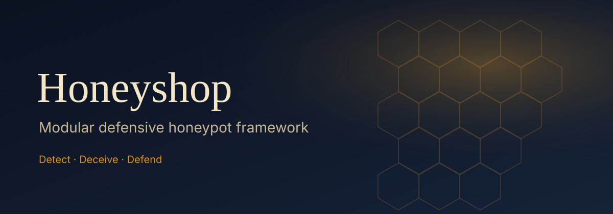

<p align="center">
  
</p>

<h1 align="center">Honeyshop</h1>

<p align="center">
  <strong>Lightweight alternative to T-Pot — own the code, not a multi-daemon appliance.</strong><br/>
  Python product logic · Astro UI · optional Rust trap · eBPF → Slack/email<br/>
  <em>Detect · Deceive · Defend</em>
</p>

<p align="center">
  
</p>

<p align="center">
  <a href="#run">Run</a> ·
  <a href="#vs-t-pot">vs T-Pot</a> ·
  <a href="#architecture">Architecture</a> ·
  <a href="#elk-stack-integration">ELK</a> ·
  <a href="#safety">Safety</a>
</p>

---

## vs T-Pot

| | **T-Pot** | **Honeyshop** |
|--|-----------|----------------|
| Shape | Shell + C + Docker packaging many third-party daemons | Python engine + Astro control UI + optional Rust hot path |
| Ownership | Appliance / multi-image surface | Small, readable product codebase |
| Differentiator | Broad honeypot zoo | eBPF host watch → Slack/email, decoy noise, WebSocket live feed, obsidian+gold UI |

**Brand:** Navy `#0B1220` · Gold `#F5C16C` / `#D4922A` · Cream `#F5E6C8`

## Run

Four processes (or use the supervisor for API + stream):

```bash
# 1) Engine (or Rust trap — pick one listener owner)
python -m honeyshop
# optional: sudo python -m honeyshop --ebpf --decoy
# optional: cargo run --release -p honeyshop-trap -- crates/honeyshop-trap/config.example.toml

# 2) Control API  → :8787
python -m honeyshop.api_server

# 3) Live WebSocket → :8788 /ws/interactions
python -m honeyshop.stream

# 4) UI → :4321
cd web && npm install && npm run dev
```

One-command helper (API + stream; add `--engine` for listeners):

```bash
python scripts/honeyshop-up.py
python scripts/honeyshop-up.py --engine
```

| Surface | Port / URL |
|---------|------------|
| Control API | http://127.0.0.1:8787 |
| WebSocket | ws://127.0.0.1:8788/ws/interactions |
| UI | http://127.0.0.1:4321 |
| SSH / HTTP / FTP (default) | `:2222` / `:8080` / `:2121` |

UI env: `PUBLIC_HONEYSHOP_API` (default `http://127.0.0.1:8787`), optional `PUBLIC_HONEYSHOP_WS`.

### Install

```bash
python -m venv .venv
source .venv/bin/activate   # Windows: .venv\Scripts\activate
pip install -r requirements.txt
```

### Useful engine flags

```bash
python -m honeyshop --ssh-port 2222 --http-port 8080 --ftp-port 2121
python -m honeyshop --log-file /var/log/honeyshop.jsonl
python -m honeyshop --ebpf --decoy --slack-webhook https://hooks.slack.com/...
```

## Control plane

API (`python -m honeyshop.api_server`):

| Method | Path | Purpose |
|--------|------|---------|
| GET | `/api/health` `/api/status` `/api/features` `/api/config` | Health, feature matrix, config |
| GET | `/api/interactions` `/api/services` `/api/alerts` `/api/overview` | Data for UI |
| POST | `/api/config` | Save Slack / SMTP (→ `config/runtime.json` + env) |
| POST | `/api/control` | `{ "action": "start_decoy" \| "stop_decoy" \| "test_alert" }` |

**Settings UI** is the control plane: feature matrix, decoy start/stop, alert save + test, eBPF status.

### Honest limits (not fully UI-controlled)

- **eBPF** needs root + `bpftrace` on the **engine** process — Settings shows status + CLI, no fake toggle.
- **Binding service ports** is host process (Python engine or Rust trap), not the browser.
- **ELK** deploy is separate compose/docs.

## JSONL schema (stable)

Core fields: `timestamp`, `level`, `logger`, `message`, `service`, `src_ip`, `src_port`, `event`, `data`  
Optional: `decoy` (bool), `trap` (`"rust"`)

Default path: `logs/honeyshop.jsonl`

## Architecture

```
Internet → listeners → logs/honeyshop.jsonl
  Python engine:  python -m honeyshop [--ebpf] [--decoy]
  Rust trap:      crates/honeyshop-trap  (std threads today; Tokio path in crate README)
  Control API:    python -m honeyshop.api_server  → :8787
  WebSocket:      python -m honeyshop.stream       → :8788
  UI:             web/ (Astro)                     → :4321
```

eBPF host watch is **bpftrace**-based — see [docs/AYA.md](docs/AYA.md) (Aya not in tree).

## Docker (honeypot only)

```bash
docker compose up -d --build
```

## ELK Stack Integration

```bash
docker compose -f docker-compose.yml -f docker-compose.elk.yml up -d --build
```

| Service        | URL / Port              |
|----------------|-------------------------|
| Honeypot SSH   | `:2222`                 |
| Honeypot HTTP  | `:8080`                 |
| Honeypot FTP   | `:2121`                 |
| Elasticsearch  | http://localhost:9200   |
| Kibana         | http://localhost:5601   |

Import `elk/dashboards/honeyshop-dashboard.ndjson` via Stack Management → Saved Objects.

- Sigma: `elk/sigma/`
- Elastic Security: `elk/elastic-security/`
- Elastic Agent notes: `elk/elastic-agent/`

## Tests

```bash
pip install pytest
pytest -q
```

## Safety

This is a **defensive** tool only (honeypots, monitoring, decoys, alerts).  
No offensive tooling. Use only on systems you own or are authorized to monitor.  
Do not expose honeypots to the public internet without isolation and legal review.

## License

MIT
